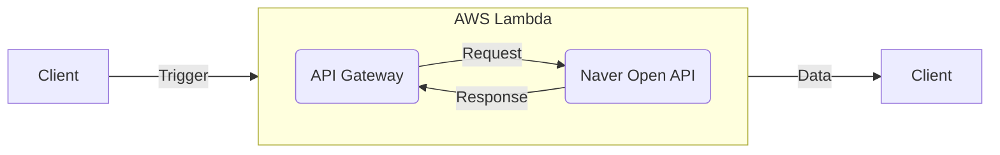

# 네이버 쇼핑 키워드/연령별 트렌드 시각화 미니 프로젝트

> _네이버 Open API에서 제공하는 키워드/연령별 트렌드 데이터를 시각화한 미니 어플리케이션입니다_

- Live Demo : https://shopping-insight.romantech.net
- 작업 기간 : 4일 (리팩토링 / 배포 작업 기간 제외)

## 사용 스택 (클라이언트)

- React + TypeScript
- Redux + Saga
- Styled-Components + Ant Design
- ESLint(Airbnb 규칙) + Prettier

## 구현 내역

- 네이버 Open API [키워드/연령별 트렌드 조회 데이터](https://bit.ly/3i5lES4) 사용
- 차트 라이브러리([Rechart](https://recharts.org/))를 이용해 연령별 라인 차트 시각화
- 사용자가 선택한 검색 파라미터 및 렌더링 완료한 차트 데이터는 리덕스 상태로 저장
  - (필수 / 기본값 지정) 시작/종료 날짜 : Single Date Picker
  - (필수 / 기본값 지정) 구간 단위 : 단일 선택 Form
  - (필수 / 기본값 지정) 카테고리 : 검색/선택 가능한 리스트 Form
  - (필수) 검색 키워드 : 텍스트 Input Form
  - 기기 : 단일 선택 Form
  - 성별 : 단일 선택 Form
  - 연령대 : 다중 선택 Form
- 새로고침 혹은 재접속 시 마지막으로 선택한 검색 파라미터 자동 적용 후 차트 렌더
- 필수 파라미터에 대한 유효성 검사 및 툴팁 안내 (유효성 검사를 모두 통과해야만 검색 버튼 활성화)
  - 시작 날짜 : 2017-08-01 ~ 종료 날짜 / 오늘 날짜
  - 종료 날짜 : 2017-08-01 / 시작 날짜 ~ 오늘 날짜
  - 키워드 : 최소 1글자 이상
  - 구간 단위 / 카테고리 : 1개 이상 선택되도록 강제
- 조회한 데이터 텍스트 요약 표시
  - 입력한 키워드를 가장 많이/적게 검색한 연령대(10대~60대) 표시
  - 모든 연령대/기간 중 가장 많이/적게 검색한 날짜 표시
- Redux Saga 활용 비동기 처리(API 호출)

## 배포 환경 CORS 오류 해결
- 네이버 Open API는 요청 헤더에 `ID`/`Secret`이 노출되므로 브라우저 요청을 허용하지 않음 → CORS 에러 발생
- 이를 해결하기 위해 [http-proxy-middleware](https://www.npmjs.com/package/http-proxy-middleware) 라이브러리를 사용할 수 있지만 개발 환경에서만 사용 가능
- AWS EC2 인스턴스에 간단한 서버를 구축하는 방법도 있지만 단순 CORS 오류 대응 용도로는 낭비라고 판단
- AWS Lambda는 월 100만 건(요청), 400,000GB-초(소요시간)까지 무료로 사용할 수 있어 미니 프로젝트에 적합 ↓

## 개발 환경 프로젝트 실행 방법 (Proxy 활용 로컬 서버 → 네이버 API 요청)

1. **레포지토리 클론 :** `git clone https://github.com/romantech/shopping-insight.git`
2. **종속성 설치 :** `npm install`
3. **환경 변수 세팅 :** `REACT_APP_NAVER_CLIENT_[ID|SECRET]` 입력 ([네이버 개발자 센터](https://developers.naver.com/apps/#/register)에서 API Key 발급 필요)
4. **프로젝트 시작 :** `npm start`
